[LinkedIn](https://linkedin.com/in/tia-parekh-909) · [tiaparekh9@gmail.com](mailto:tiaparekh9@gmail.com)

## Featured Projects

Autonomous 6-legged robot: 18-servo tripod gait, inverse kinematics, Gazebo simulation, camera-based object detection, and a voice I/O pipeline.
`ROS2` `Gazebo` `Python` `OpenCV`

ESP32 firmware driving the hexapod's 18 servos over PCA9685 PWM drivers, with a JSON serial command protocol.
`C++` `PlatformIO`

Multi-agent tool that researches organizations and drafts personalized outreach emails from a resume/CV.
`Python`

CNN trained on 500+ images to sort produce at 88% accuracy — 2nd place, Alameda County Science Fair.
`Python` `OpenCV` `TensorFlow`

Also: FTC competition robot code (private repos).

## Skills

<table>
<tr>
<td align="center" width="90"> Python</td>
<td align="center" width="90"> C++</td>
<td align="center" width="90"> Java</td>
<td align="center" width="90"> HTML/CSS</td>
<td align="center" width="90"> LaTeX</td>
</tr>
<tr>
<td align="center"> React</td>
<td align="center"> Node.js</td>
<td align="center"> Git</td>
<td align="center"> PlatformIO</td>
<td align="center"> ROS2</td>
</tr>
<tr>
<td align="center"> Arduino</td>
<td align="center"> Raspberry Pi</td>
<td align="center"> KiCad</td>
<td align="center"> OpenCV</td>
<td align="center"> TensorFlow</td>
</tr>
<tr>
<td align="center"> Fusion 360</td>
<td align="center"> BambuLab</td>
<td align="center"> Colab</td>
<td align="center"> Replit</td>
<td></td>
</tr>
</table>

*Also: Onshape, GCode, VS Code, laser cutting, CNC, soldering — no icon set covers everything.*

## Currently

Building out the hexapod's tripod gait in simulation, bridging ESP32 servo control over serial, and starting on a reinforcement-learning locomotion policy.

